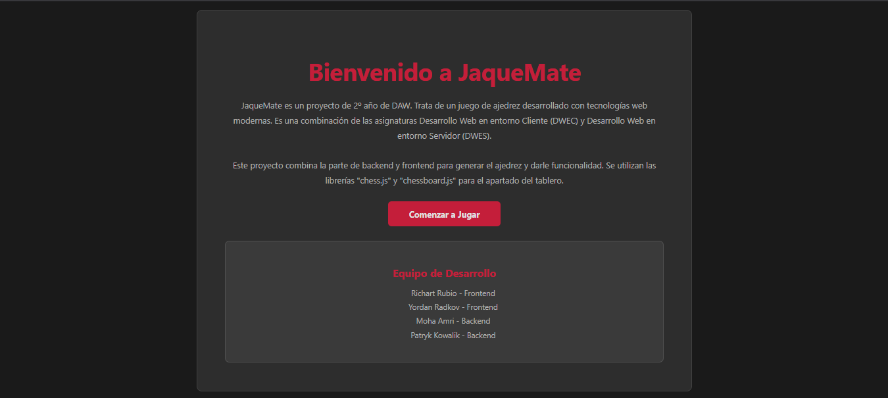
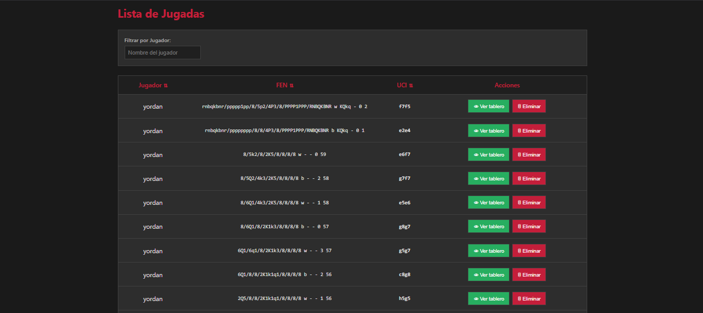
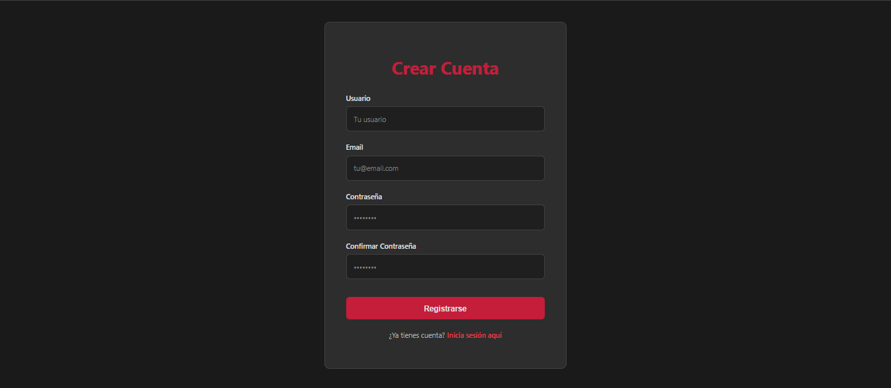
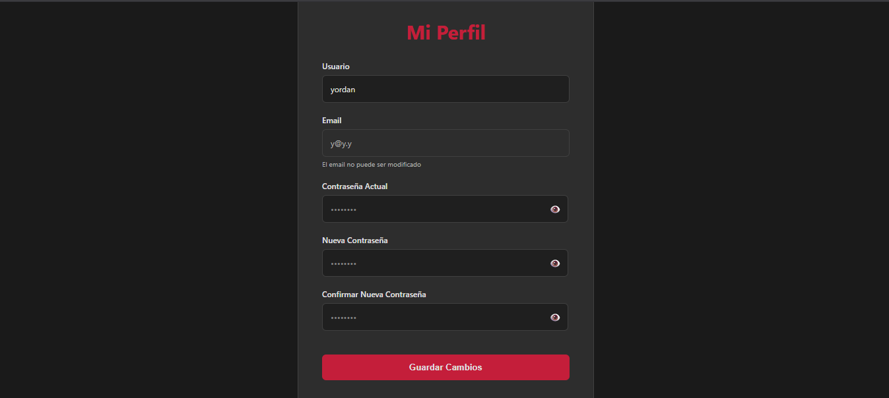
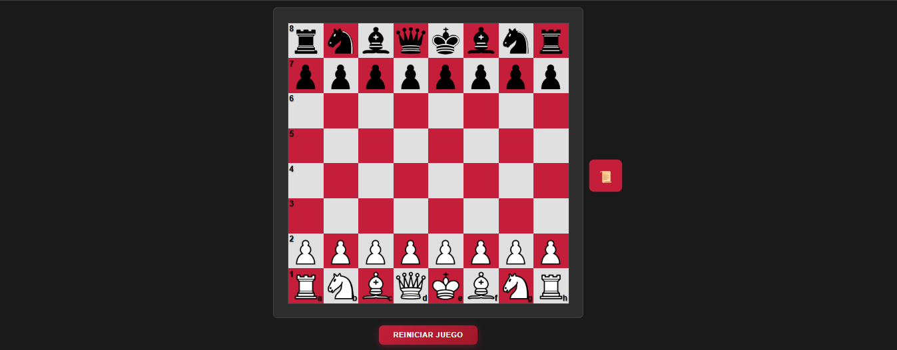
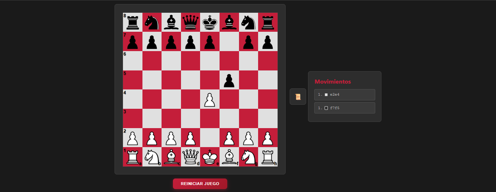
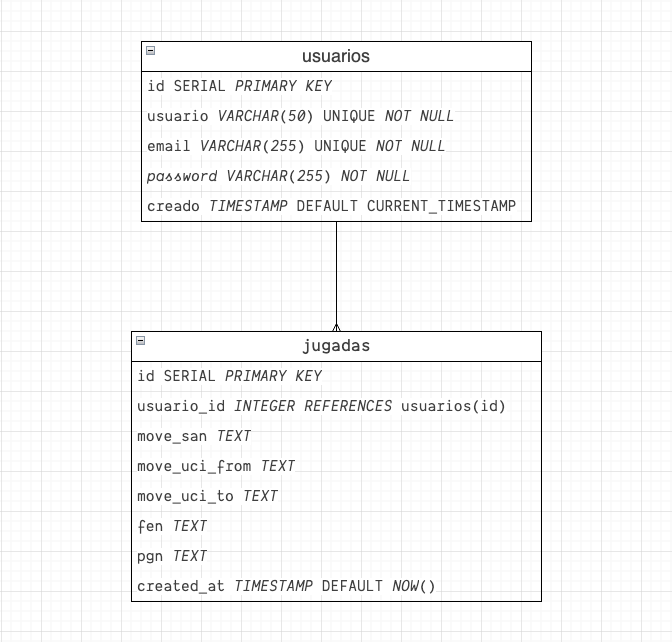

# Proyecto de Ajedrez JaqueMate

JaqueMate es una aplicación web full-stack diseñada para registrar y analizar partidas de ajedrez. Permite a los usuarios gestionar sus perfiles, registrar jugadas detalladas y visualizar el historial de movimientos. La aplicación está completamente dockerizada para un despliegue y desarrollo sencillos.

## 🎨 Paleta de Colores

### Fondos
| Color | Código Hexadecimal | Uso |
|-------|-------------------|-----|
| Fondo Principal | `#1a1a1a` | Fondo principal de páginas |
| Header/Footer/Cards | `#2d2d2d` | Header, footer, cards, formularios |
| Hover States | `#3a3a3a` | Hover states, elementos destacados |

### Rojos (Acentos)
| Color | Código Hexadecimal | Uso |
|-------|-------------------|-----|
| Rojo Principal | `#c41e3a` | Botones, enlaces, títulos |
| Rojo Oscuro | `#8b1628` | Hover en botones |
| Rojo Claro | `#e63946` | Highlights |

### Textos
| Color | Código Hexadecimal | Uso |
|-------|-------------------|-----|
| Texto Principal | `#e0e0e0` | Texto principal |
| Texto Secundario | `#b0b0b0` | Texto secundario |
| Texto Deshabilitado | `#808080` | Texto deshabilitado |

### UI
| Color | Código Hexadecimal | Uso |
|-------|-------------------|-----|
| Bordes Principales | `#404040` | Bordes principales |
| Bordes Secundarios | `#505050` | Bordes secundarios |
| Sombras/Fondos Inputs | `#1f1f1f` | Sombras, fondos inputs |

### Tablero
| Color | Código Hexadecimal | Uso |
|-------|-------------------|-----|
| Casillas Claras | `#d4d4d4` | Casillas claras del tablero |
| Casillas Oscuras | `#4a4a4a` | Casillas oscuras del tablero |

---

## 🔤 Tipografías

### Tipografía Principal
```
'Inter', 'Segoe UI', system-ui, -apple-system, sans-serif
```
**Uso:** Texto general, navegación, botones, formularios y contenido principal.

### Tipografía Monoespaciada
```
'Roboto Mono', 'Courier New', monospace
```
**Uso:** Notación de jugadas, código y elementos que requieren espaciado monoespaciado.

---

## 📋 Notas de Implementación

- Todos los colores han sido definidos siguiendo un esquema de tema oscuro
- La paleta de rojos proporciona suficientes variaciones para la parte de interactividad
- Las tipografías seleccionadas ofrecen buena legibilidad en la pantalla

## Imagenes de las diferentes partes de la web


---

---

---

---

---

---

---

---

---

---

---

## Arquitectura

El proyecto sigue una arquitectura de tres capas:

- **Frontend:** Una aplicación de una sola página (SPA) construida con Vanilla JavaScript y Web Components. Se encarga de la interfaz de usuario y la interacción con el tablero de ajedrez.
- **Backend:** Una API RESTful construida con Java y Spring Boot. Gestiona la lógica de negocio, la autenticación de usuarios y la comunicación con la base de datos.
- **Base de Datos:** Una base de datos PostgreSQL que persiste los datos de usuarios y jugadas.



---

## Pila Tecnológica

| Componente    | Tecnología Principal        | Descripción                                                                                              |
|---------------|-----------------------------|----------------------------------------------------------------------------------------------------------|
| **Backend**   | **Java 21 / Spring Boot 3** | Framework principal para construir la API REST.                                                          |
|               | Spring Data JPA / Hibernate | Para el acceso a datos y mapeo objeto-relacional (ORM).                                                  |
|               | Spring Security             | Gestiona la autenticación y autorización (implícito, probablemente con JWT).                            |
|               | PostgreSQL Driver           | Conector para la base de datos PostgreSQL.                                                               |
|               | Maven                       | Herramienta de gestión de dependencias y construcción del proyecto.                                      |
|               | SpringDoc (Swagger)         | Genera documentación interactiva para la API.                                                            |
| **Frontend**  | **Vanilla JavaScript (ESM)**| Lógica principal de la aplicación sin frameworks pesados.                                                |
|               | Vite                        | Herramienta de construcción y servidor de desarrollo rápido.                                             |
|               | Web Components              | Para crear componentes de UI encapsulados y reutilizables.                                               |
|               | `chess.js`                  | Librería para la validación de movimientos y gestión del estado del juego de ajedrez.                    |
|               | `rxjs`                      | Para manejar el estado de la aplicación de forma reactiva.                                               |
|               | `chessboard2.js`            | Librería para renderizar el tablero de ajedrez visual.                                                   |
| **Base de Datos**| **PostgreSQL 17**         | Sistema de gestión de bases de datos relacional para almacenar los datos.                                |
| **Contenedores**| **Docker / Docker Compose** | Para crear, desplegar y orquestar los diferentes servicios de la aplicación de manera aislada.          |

---

## Guía de Inicio Rápido

La forma más sencilla de ejecutar el proyecto es usando Docker Compose, que orquestará los servicios de backend, frontend y base de datos.

1.  **Clonar el repositorio:**
    ```bash
    git clone https://github.com/xsha256/jaqueMate.git
    cd jaqueMate
    ```

2.  **Levantar los servicios:**
    Asegúrate de tener Docker y Docker Compose instalados. Luego, ejecuta el siguiente comando desde la raíz del proyecto:
    ```bash
    docker-compose up --build
    ```
    Este comando construirá las imágenes de los contenedores (si no existen) y los iniciará.

3.  **Acceder a la aplicación:**
    - **Frontend:** Abre tu navegador y ve a `http://localhost:5173`
    - **Backend API (Swagger UI):** Accede a la documentación de la API en `http://localhost:8090/swagger-ui/index.html`

---

## Características Principales

-   **Gestión de Usuarios:** Registro, inicio de sesión y gestión de perfiles de usuario.
-   **Registro de Jugadas:** Guarda un historial de las jugadas de una partida, incluyendo la notación (SAN, UCI) y el estado del tablero (FEN).
-   **Visualización de Partidas:** Un tablero interactivo permite visualizar las partidas guardadas.
-   **Importación/Exportación CSV:**
    -   **Importar:** Sube un archivo `csv` para añadir múltiples jugadas a la base de datos de un usuario.
    -   **Exportar:** Descarga el historial de jugadas de un usuario en formato `csv`.
-   **API Documentada:** La API del backend está documentada con Swagger, facilitando la prueba y el desarrollo.

---

## Endpoints de la API

La API base se encuentra en `http://localhost:8090/api/v1`.

### Usuario (`/usuarios`)

-   `POST /registro`: Registra un nuevo usuario.
-   `POST /login`: Inicia sesión y obtiene un token de autenticación.
-   `GET /perfil`: Obtiene los detalles del perfil del usuario autenticado.
-   `PUT /perfil`: Actualiza los detalles del perfil del usuario.

### Jugadas (`/jugadas`)

-   `POST /`: Crea una nueva jugada.
-   `GET /`: Obtiene una lista paginada de todas las jugadas.
-   `GET /usuario/{id}`: Obtiene todas las jugadas de un usuario específico.
-   `POST /importar/csv`: Importa jugadas desde un archivo CSV.
-   `GET /exportar/csv`: Exporta las jugadas del usuario a un archivo CSV.
-   `DELETE /{id}`: Elimina una jugada por su ID.


